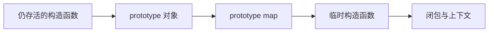
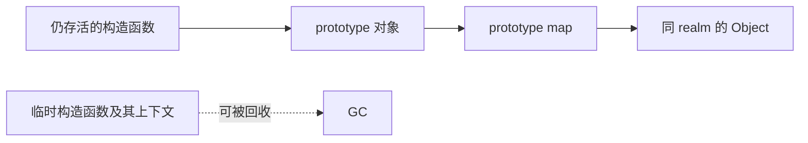

# V8 为什么在优化原型对象时，把 Map 的 constructor 改成 Object？

在阅读 V8 的 `JSObject::OptimizeAsPrototype()` 时，我遇到了一个看上去相当反直觉的操作：当一个普通对象被提升为“原型对象”后，V8 会复制它的 `Map`，把新 `Map` 标记为 prototype map，**并在满足条件时，将内部的 constructor 从原来的构造函数改成当前 realm 的 `Object`**。

这不会破坏 JavaScript 的继承语义吗？如果一个JS原型对象明明由 `Animal` 构造，V8 却在内部把它的 constructor 记成 `Object`，`instanceof`、`obj.constructor` 或原型链查找会不会出错？

答案是：**不会。这是 V8 有意为之的内存优化。它利用“精确的构造函数身份对 JavaScript 不可观察”这一前提，切断一条没有继续保留价值的强引用，使临时构造函数及其闭包环境能够更早被垃圾回收。**

真正容易误解的地方，不是这段代码本身，而是 `Map::constructor_or_back_pointer` 这个字段的语义。

## 从一个反直觉的例子说起

考虑 ES6 `class` 出现以前常见的继承写法：

```js
function Animal(name) {
  this.name = name;
}

Animal.prototype.sayHello = function () {
  console.log("I'm " + this.name);
};

function Dog(name) {
  Animal.call(this, name);
}

Dog.prototype = new Animal();
Dog.prototype.constructor = Dog;

Dog.prototype.bark = function () {
  console.log("Woof!");
};
```

执行：

```js
Dog.prototype = new Animal();
```

时，右侧对象成为 `Dog` 的原型对象。V8 会通过函数 `prototype` 属性的 setter（`Accessors::FunctionPrototypeSetter()`）走到 `JSObject::OptimizeAsPrototype()`，为该对象准备专门的 prototype map。

相关代码的核心逻辑可以概括为：

```cpp
Handle<Map> new_map = Map::Copy(...);
new_map->set_is_prototype_map(true);

Tagged<Object> maybe_constructor = new_map->GetConstructorRaw();
if (IsJSFunction(maybe_constructor)) {
  Tagged<JSFunction> constructor = Cast<JSFunction>(maybe_constructor);
  if (!constructor->shared()->IsApiFunction()) {
    Tagged<NativeContext> context = constructor->native_context();
    Tagged<JSFunction> object_function = context->object_function();
    new_map->SetConstructor(object_function);
  }
}
```

于是，调试输出可能会告诉我们：这个 prototype map 的内部 constructor 已经不是 `Animal`，而是 `Object`。

第一反应很自然：V8 是不是把对象的构造者“记错了”？

问题恰恰出在“记错了”这个说法上——它暗含了一个并不成立的假设：`constructor_or_back_pointer` 必须永久、精确地记录对象最初由谁构造。

## 先区分三种完全不同的“constructor”

讨论这段代码前，必须把下面三件事拆开。

### 1. JavaScript 可见的 `constructor` 属性

`Dog.prototype.constructor` 是一次普通的属性访问。它按照 ECMAScript 的属性查找规则，从 `Dog.prototype` 自身开始，沿原型链寻找名为 `"constructor"` 的属性。

下面这句：

```js
Dog.prototype.constructor = Dog;
```

是在 `Dog.prototype` 上写入一个 JavaScript 可见的属性。它与 V8 `Map` 中的内部字段 `constructor_or_back_pointer` 不是同一个东西。

因此，即使 prototype map 的内部 constructor 已经被替换成 `Object`，依然可以得到：

```js
Dog.prototype.constructor === Dog; // true
```

### 2. `Map` 中的内部元数据

V8 的 `Map`，也常被称为 HiddenClass，描述对象的内部形状，例如对象类型、属性布局、元素类型、原型以及形状迁移关系。V8 官方对 HiddenClass 和属性存储的介绍可参见 [Fast properties in V8](https://v8.dev/blog/fast-properties)。

`constructor_or_back_pointer` 是一个**复用槽位**。根据 `Map` 的种类和状态，它可能保存 constructor，也可能保存形状迁移的 back pointer；在其他特殊类型的 map 中还可能承载别的内部信息。因此，不能仅凭字段名就把它理解成 JavaScript 对象的永久“出生证明”。

更准确的表述是：当该槽位处于 constructor 语义时，它是 V8 内部算法可使用的一份元数据；是否必须保留精确身份，要看后续消费者是否依赖它。

### 3. 对象最初由谁创建的历史事实

`new Animal()` 确实表示该对象最初由 `Animal` 的构造流程创建。但 ECMAScript 并没有要求引擎把这段历史永久保存在一个可观察的内部槽里。

JavaScript 真正能观察的是对象当前的属性、原型链和语言操作结果，而不是引擎内部是否仍保存着“最初由哪个函数分配”的精确记录。

这三者可以总结为：

| 概念 | 是否对普通 JavaScript 可见 | 在例子中的结果 |
| --- | --- | --- |
| `Dog.prototype.constructor` 属性 | 是 | 写入后为 `Dog` |
| prototype map 的内部 constructor | 否 | 可能被改成同 realm 的 `Object` |
| 对象最初由谁 `new` 出来 | 是历史事实，但没有对应的通用反射接口 | `Animal` |

理解了这一区分，所谓的“矛盾”就已经消失了一半。

## `OptimizeAsPrototype()` 真正在优化什么

普通实例与原型对象承担的角色不同。

普通实例的 `Map` 主要服务于对象形状、属性访问和形状迁移；一个对象一旦被放到其他对象的原型链上，V8 还需要围绕它维护原型链优化所需的基础设施，例如：

- 标记这是一个 prototype map；
- 跟踪哪些下游 map 依赖这条原型链；
- 在原型发生变化时使相关假设和优化代码失效；
- 维护 prototype validity、prototype users 等内部信息。

换句话说，对 prototype map 来说，真正有价值的是“它在原型链优化体系中的身份与依赖关系”，而不是“承载它的对象最早由哪个普通 JavaScript 函数构造”。

这也是 `OptimizeAsPrototype()` 要复制并转换 `Map` 的原因：对象的职责已经从普通实例变成了原型链节点，V8 需要为新职责建立合适的内部表示。不同 V8 版本及构建选项还可能在这一过程中调整 fast/dictionary properties；这些表示细节不影响本文的核心结论。

## 真正的动机：切断无意义的 GC 存活链

假设内部引用保持不变，可能形成如下存活关系：



只要 prototype 对象仍被使用，它的 `Map` 就仍然存活；只要 `Map` 强引用精确 constructor，constructor 及其可能关联的上下文也会继续存活。

在最初的 `Animal`/`Dog` 示例中，`Animal` 本身可能还被全局变量引用，因此不容易直观看到收益。传统的寄生组合继承辅助函数更能暴露问题：

```js
function inherit(Child, Parent) {
  function Temp() {}
  Temp.prototype = Parent.prototype;

  Child.prototype = new Temp();
  Child.prototype.constructor = Child;
}
```

`Temp` 只为搭建原型链而临时存在。`inherit()` 返回后，程序已经不再需要它。如果 `Child.prototype` 的 map 仍强引用 `Temp`，这个临时函数就会因为一条纯内部引用而被迫继续存活；如果 `Temp` 捕获了外部变量，还可能连带保活更多闭包状态。

V8 的处理方式是把这条边重定向到当前 realm 的 `Object`：



这项替换有三个特点：

1. `Object` 本来就是当前 realm 的基础设施，通常会随该 realm 长期存活，因此不会额外保活一棵短命对象图。
2. V8 仍保留了一个来自同一 native context 的函数，可供只需要 realm/context 信息的内部路径使用。
3. 精确 constructor 身份既不再有用，又不能被普通 JavaScript 观察，因此删除它不会改变语言语义。

源码注释已经直接说明了目的：当精确 constructor 对 JavaScript 不可探测时，用同一 context 的 `Object` 替代，避免不必要地延长内存存活时间。相关实现可在 V8 的 [`JSObject::OptimizeAsPrototype()`](https://chromium.googlesource.com/v8/v8/+/refs/heads/main/src/objects/js-objects.cc) 中查看。

## 为什么一定是“同 realm”的 Object

页面中的 iframe、Node.js 的 `vm` context 等场景会产生不同的 realm。每个 realm 都有自己的一组内建对象和函数，包括自己的 `Object`。

因此，V8 不能随意塞入某个全局共享的 `Object`。从原 constructor 取得 `native_context`，再取这个 context 的 `object_function()`，可以在丢弃精确函数身份的同时保留 realm 归属：

```cpp
Tagged<NativeContext> context = constructor->native_context();
Tagged<JSFunction> object_function = context->object_function();
```

这是一种信息降级：

```text
精确 constructor 身份 + realm 信息
              ↓
          realm 信息
```

V8 丢掉的是不再需要、且会造成保活成本的部分，而不是把槽位清成一个毫无语义的任意值。

## 为什么不会影响 JavaScript 行为

可以逐项检查常见的担忧。

### `Dog.prototype.constructor`

不受影响。它读取的是 JavaScript 属性，而不是 `Map` 的内部 constructor 槽。

```js
Dog.prototype.constructor = Dog;
console.log(Dog.prototype.constructor === Dog); // true
```

### `instanceof`

不受影响。`instanceof` 的普通路径关心右侧函数的 `.prototype` 是否出现在左侧对象的原型链中，而不是对象 `Map` 里是否还保存着精确 constructor。

```js
const dog = new Dog('旺财');

console.log(dog instanceof Dog);    // true
console.log(dog instanceof Animal); // true
```

这里第二个结果为 `true`，是因为原型链仍然是：

```text
dog → Dog.prototype → Animal.prototype → Object.prototype → null
```

### 方法查找

不受影响。`sayHello` 和 `bark` 的查找依赖对象的实际原型链与属性表：

```js
dog.sayHello();
dog.bark();
```

`Map` 内部 constructor 的改写没有改变任何一条 JavaScript 可见的 `[[Prototype]]` 边。

### `%DebugPrint`

`%DebugPrint` 可能显示内部 constructor 为 `Object`，但它是 V8 的调试 intrinsics，不是 ECMAScript 规定的反射接口。它展示的是引擎内部表示，不能据此推导 `obj.constructor` 的语言语义。

## 为什么 API Function 是例外

代码中还有一个重要保护条件：

```cpp
if (!constructor->shared()->IsApiFunction()) {
  // 才替换为 Object
}
```

API Function 由 V8 embedder 通过 C++ API 创建，constructor 身份可能关联 `FunctionTemplate`、实例模板、回调和嵌入层类型信息。对这类函数，精确 constructor 可能仍是内部行为的一部分，不能套用“普通 JavaScript 函数的身份已经无人消费”这一判断。

所以这项优化并不是粗暴地改写所有 prototype map，而是在 V8 已确认可以安全丢弃精确信息的分支中执行。某些版本还要处理 `Tuple2 { constructor, non_instance_prototype }` 的复合存储形式；实现会只替换其中的 constructor 部分，保留另一部分信息。

## 一个更严谨的闭环

现在可以把整个设计归纳为四步：

1. **职责发生变化。** 一个普通对象被用作原型后，V8 将其转换为 prototype map，重点转向原型链依赖、有效性和失效机制。
2. **精确身份不再必要。** 对普通 JavaScript constructor 而言，原型对象“最初由谁构造”不参与此后的 JavaScript 可观察语义；`obj.constructor` 也不是从该内部槽读取。
3. **保留身份存在成本。** `Map → constructor` 是一条 GC 可达性边，可能让本应死亡的临时函数、native context 或闭包环境继续存活。
4. **用同 realm 的 `Object` 重定向引用。** 这样既切断了无意义的保活链，又保留了内部代码可能需要的 realm 锚点；API Function 等仍依赖精确信息的情况则被排除在外。

所以，问题的答案不是“V8 把构造函数记错了”，而是：

> **`constructor_or_back_pointer` 从来不是必须永久忠实记录对象出生历史的字段。对象成为原型后，V8 只保留后续算法真正需要的信息，并主动丢弃不可观察但会增加 GC 保活成本的精确 constructor 身份。**

## 如何阅读这类 V8 源码

这个问题也提供了一种很实用的源码阅读方法。

看到内部字段被覆盖时，不要先根据字段名推断语义，而应依次追问：

1. 这个槽位是否被复用？不同 map 类型下分别保存什么？
2. 写入发生在哪些前置条件下？哪些对象被明确排除？
3. JavaScript 能否观察到这项内部信息？通过哪条规范路径观察？
4. 这个字段有哪些消费者？它们需要精确身份，还是只需要 realm、类型或迁移信息？
5. 保留旧值会在 GC 对象图上新增或延长哪些可达路径？

只有把“生产位置、消费位置、可观察性和 GC 代价”放在一起看，才能理解引擎为何敢于丢弃一份看似重要的信息。

## 参考资料

- [V8 源码：`JSObject::OptimizeAsPrototype()`](https://chromium.googlesource.com/v8/v8/+/refs/heads/main/src/objects/js-objects.cc)
- [V8 Blog：Fast properties in V8](https://v8.dev/blog/fast-properties)
- [引入该内存优化的历史 Code Review](https://codereview.chromium.org/942493002/)

> 注：V8 内部数据结构会持续演进，具体类名、字段包装形式和属性存储策略可能随版本变化；本文讨论的是这段优化长期保持不变的设计动机与语义边界。
